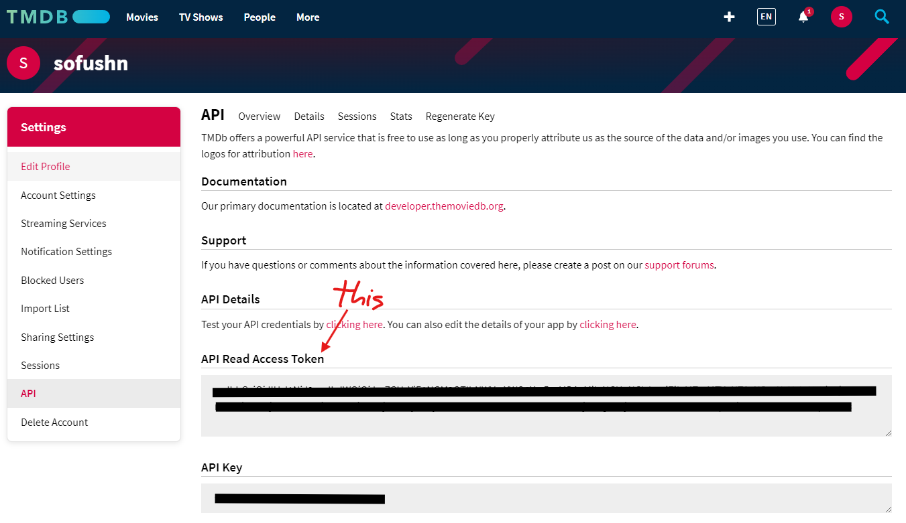

# portfolio_subproject_3

## Hot to run (without Docker)

> [!IMPORTANT]
> *Requires the .NET 8 runtime as well as Node.js v20*
> *Requires port `3000` and `5001` are avaliable on the host machine*

- Create `.env.local` in `src/frontend` and set TMDB read token (alternativly set `VITE_TMDB_READ_TOKEN` environment variable)
  ```
  VITE_TMDB_READ_TOKEN=<token>
  ```
  
- In repo root run `git submodule update --init` afterwards navigate to `src/backend/src/CitMovie.Api` and update postgres connection string in `appsettings.Development.json`

The frontend is started by navigating to `src/frontend` and running `npm run dev`.

The backend is started by navigating to `src/backend/src` and running `dotnet run --project CitMovie.Api`.

## How to run (with Docker)

*Docker Desktop must be installed and running.*

```bash
docker compose up -d
```

The backend uses HTTPS, this requires you to trust a dev certificate which the backend uses for SSL. This can be done with the commands below:

> [!NOTE]
> .NET 9 SDK or later is required on Unix systems (Mac & Linux)

```bash
mkdir $HOME/.aspnet/https
dotnet dev-certs https -ep $HOME/.aspnet/https/aspnetapp.pfx -p password --trust
```


### Update to latest version

When new version of either the database or backend is released you can update by shutting down the existing services and starting them again:

```bash
docker compose down
docker compose pull
docker compose up -d
```

If you are running the development compose you can build new versions by using the `--build` flag (this requires that you have downloaded the submodules for the backend and database):

```bash
docker compose -f ./compose.development.yaml down
docker compose -f ./compose.development.yaml up --build -d
```

### Release new versions 

You can build new image versions and push them to ghcr manually, see GitHub [documentation](https://docs.github.com/en/packages/working-with-a-github-packages-registry/working-with-the-container-registry) for detialed explanaiton.

